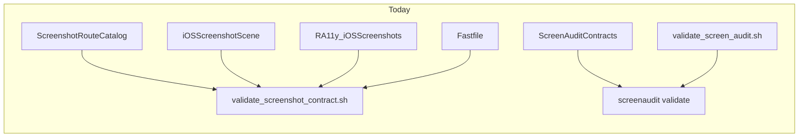

# High-impact Screen Audit / Screenshot UX plan

## Current pain (baseline)

- Contributors touch **five conceptual surfaces**: [ScreenshotRouteCatalog.md](RA11y-iOS/RA11y-iOSUITests/ScreenshotRouteCatalog.md), [iOSScreenshotScene.swift](RA11y-iOS/RA11y-iOS/App/iOSScreenshotScene.swift), [RA11y_iOSScreenshots.swift](RA11y-iOS/RA11y-iOSUITests/RA11y_iOSScreenshots.swift), [Fastfile](fastlane/Fastfile) (`UI_TEST_IDS` + catalog extraction checks), and [ScreenAuditContracts.json](RA11y-iOS/RA11y-iOSUITests/ScreenAuditContracts.json) (+ optional [ScreenAuditAssetProvenance.json](RA11y-iOS/RA11y-iOSUITests/ScreenAuditAssetProvenance.json)).
- [utility/validate_screen_audit.sh](utility/validate_screen_audit.sh) hardcodes RA11y paths and requires **device subfolders** under the screenshot root; OCR is toggled via `RA11Y_SCREEN_AUDIT_OCR` (easy to forget).
- [ScreenAuditKit](ScreenAuditKit/Sources/ScreenAuditKit/Reports/ScreenAuditReports.swift) already emits a solid [summary.md](ScreenAuditKit/Sources/ScreenAuditKit/Reports/ScreenAuditReports.swift) (hard-failure counts + review table), but the **CLI** only prints output file paths on success ([ScreenAuditKit.swift](ScreenAuditKit/Sources/ScreenAuditKit/ScreenAuditKit.swift)); on validation failure stderr is minimal relative to the rich Markdown.

## Recommended delivery order (impact vs effort)

### 1. Golden path document (highest leverage, docs-only)

Add **one canonical entry doc** (suggested: [memlog/research/ScreenshotAndScreenAudit-GoldenPath.md](memlog/research/ScreenshotAndScreenAudit-GoldenPath.md)) that:

- States the **one-line local checks** in order: `utility/validate_screenshot_contract.sh` then `utility/validate_screen_audit.sh` (with when to set `RA11Y_SCREEN_AUDIT_OCR=vision`).
- Gives a **checklist table**: “new screenshoted screen” = same four-file rule as [AGENTS.md](AGENTS.md) screenshot automation contract **plus** update `ScreenAuditContracts.json` / provenance when adding rules.
- Links to existing authoritative sources ([ScreenAuditKit README](ScreenAuditKit/README.md) RA11y Integration, route catalog header, Fastlane lanes).

Wire **short pointers** from [ScreenAuditKit/README.md](ScreenAuditKit/README.md) (RA11y Integration) and optionally a single sentence in [AGENTS.md](AGENTS.md) under the screenshot contract section so discoverability does not depend on memlog search.

**Out of scope for this doc:** duplicating full JSON schema (link to README Contract Format).

---

### 2. `screenaudit doctor` equivalent in `utility/` (pre-flight, no PNGs required)

Per [ScreenAuditKit-Workstream.md](memlog/research/ScreenAuditKit-Workstream.md) (RA11y adapter stays outside generic package), implement **`utility/screenaudit_doctor.sh`** (bash + `jq`; no new ad-hoc Python) that:

1. **Delegates** to existing [utility/validate_screenshot_contract.sh](utility/validate_screenshot_contract.sh) (unchanged; keeps Fastlane/UI/scene/catalog alignment).
2. **Parses** [ScreenAuditContracts.json](RA11y-iOS/RA11y-iOSUITests/ScreenAuditContracts.json) with `jq`:
   - Every `screens[].filename` basename matches a **File** cell in [ScreenshotRouteCatalog.md](RA11y-iOS/RA11y-iOSUITests/ScreenshotRouteCatalog.md) required table (normalize: catalog uses `01_Hub`, contract uses `01_Hub.png`).
   - Every `flows[].steps[].screenID` exists in `screens[].id`.
   - Optional: `assetProvenancePath` file exists relative to UITests dir when set.
3. **Optional `--with-audit`**: if `docs/screenshots/en-US/<device>/` exists, invoke [utility/validate_screen_audit.sh](utility/validate_screen_audit.sh) with `RA11Y_SCREEN_AUDIT_OCR` defaulting to `none` for speed (document that CI uses `vision` via Fastlane).

Exit non-zero with a **numbered, grouped error list** (screenshot pipeline vs screen audit contract). Document the script in the golden path doc.

**Tests:** AGENTS discourages new Python one-liners; add **lightweight** checks via `bash -n` in an existing shell validation script if one exists, or document manual verification in the golden path until a small `ScreenAuditKit` unit test is justified for markdown parsing (likely overkill—prefer bash + fixture copy in `utility/` self-check section in README).

---

### 3. Fewer knobs: documented profiles + thin wrapper (optional script flag)

- Extend [utility/validate_screen_audit.sh](utility/validate_screen_audit.sh) to accept optional **`--ocr vision|none`** (overrides env) so callers do not depend on remembering `RA11Y_SCREEN_AUDIT_OCR` for local runs.
- Document **`RA11Y_SCREEN_AUDIT_PROFILE=ci`** (or similar) in the golden path: maps to `vision` for Fastlane parity; default local = `none` for speed.

Update [fastlane/Fastfile](fastlane/Fastfile) only if it simplifies invocation (pass `--ocr vision` explicitly instead of/in addition to env—pick one source of truth to avoid drift).

---

### 4. Richer human output (small Swift change + CLI tweak)

In [ScreenAuditReports.swift](ScreenAuditKit/Sources/ScreenAuditKit/Reports/ScreenAuditReports.swift) `markdownSummary`:

- Add **warning vs error counts** (filter by severity) next to existing hard-failure line.
- Add a short **“Where to look next”** block: relative path to `overlays/` and reminder that `flow-summary.md` exists when flows are configured.

In [ScreenAuditKit.swift](ScreenAuditKit/Sources/ScreenAuditKit/ScreenAuditKit.swift) `runValidate`:

- On **validation failure** (exit 1), print **one stderr line** pointing to `summary.md` path (already known) so CI logs surface the right file without opening JSON first.

Add/adjust tests in [ScreenAuditReportTests.swift](ScreenAuditKit/Tests/ScreenAuditKitTests/ScreenAuditReportTests.swift) for the new summary lines.

---

### 5. Editor tasks (repo-local, optional)

Add [`.vscode/tasks.json`](.vscode/tasks.json) (or `.cursor`-compatible tasks if the team standardizes on that) with:

- `Screenshot contract check` → `utility/validate_screenshot_contract.sh`
- `Screen audit doctor` → `utility/screenaudit_doctor.sh`
- `Screen audit (committed screenshots)` → `utility/validate_screen_audit.sh` with args

No Xcode GUI; tasks are CLI-only. Update [memlog/DirectoryTree.txt](memlog/DirectoryTree.txt) when adding the file.

---

### 6. Contract scaffolding / drift detection (phase 2—higher design cost)

**Drift detection** is largely covered by doctor (catalog filename vs contract).

**Generation** of new `screens[]` rows from the markdown table is optional and can be:

- A **`--emit-stub`** mode on `screenaudit_doctor.sh`** that prints a **JSON fragment** (stdout) for missing catalog rows only, using `awk`/`sed` to parse the same table shape as today’s Python in `validate_screenshot_contract.sh`, **or**
- A documented `jq` recipe in the golden path for copy-paste.

Prefer **doctor emits stubs** only after drift detection is stable, to avoid two parsers diverging from the Python catalog parser.

---

### 7. Progressive adoption (documentation only)

In the golden path, add a **“levels”** subsection:

- Level A: route catalog + Fastlane + dimensions-only contracts (no OCR).
- Level B: Vision + `text.required` / `forbidden` where stable.
- Level C: regions, baselines, provenance as needed.

Align wording with [ScreenAuditKit README Roadmap](ScreenAuditKit/README.md) and SAK-8/9 in [ScreenAuditKit-Workstream.md](memlog/research/ScreenAuditKit-Workstream.md).

---

## Explicit non-goals (this UX pass)

- Replacing embedded Python in `validate_screenshot_contract.sh` (large refactor; out of scope unless you explicitly want parser unification later).
- Moving RA11y paths into `ScreenAuditKit` sources (conflicts with workstream portability).
- JUnit/SARIF (SAK-9)—valuable but separate from “setup UX”.
