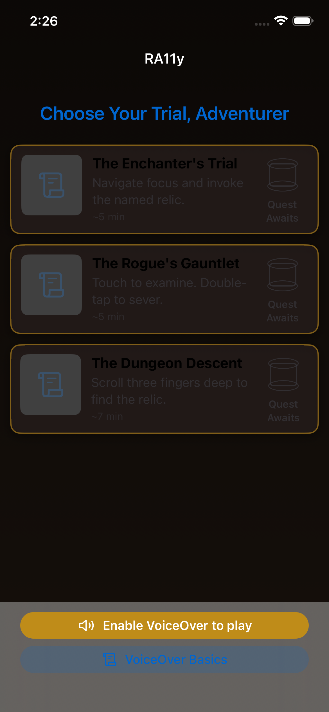
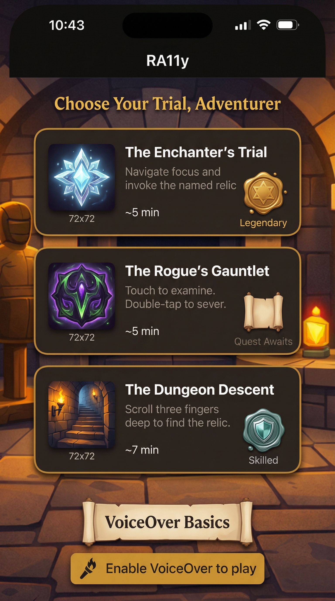
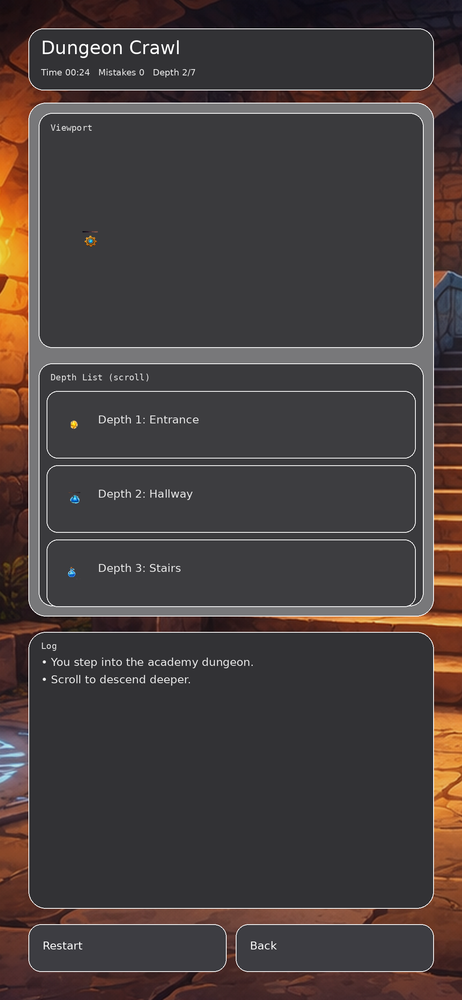
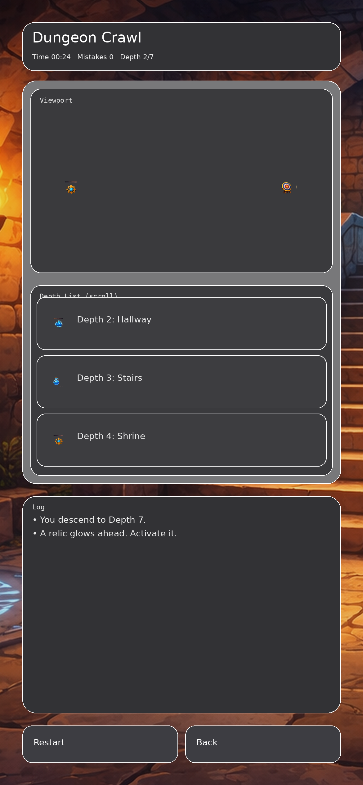
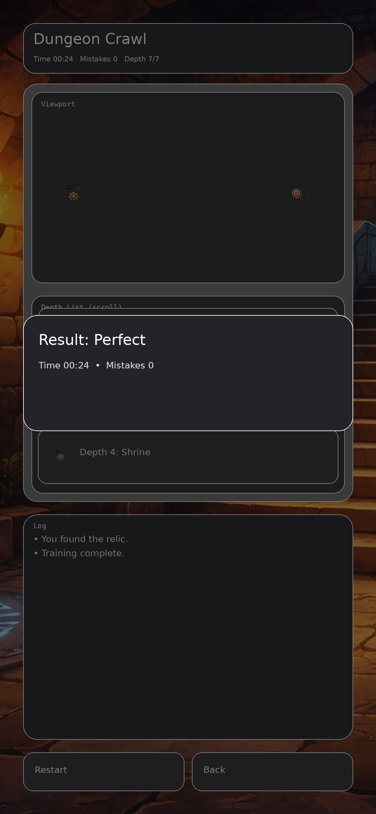
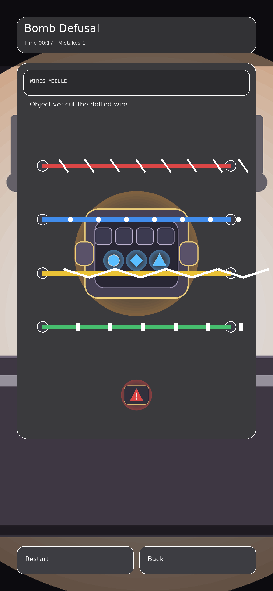
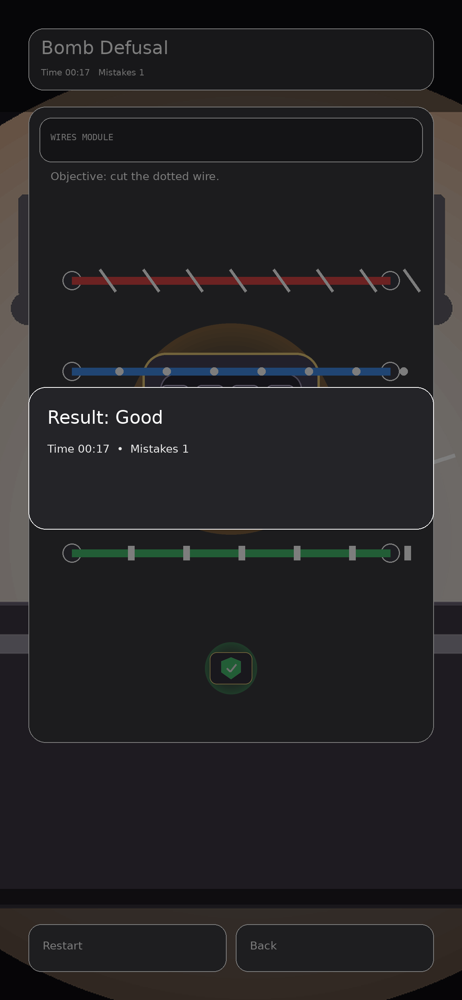

# RA11y — Accessibility Gamification

An iOS training app that teaches VoiceOver through short, themed game challenges.
Each game isolates one VoiceOver paradigm shift and walks the player through it
from a guided explanation to a timed trial.

---

## The Concept

Most accessibility training is passive: read a doc, watch a video, move on.
RA11y makes the VoiceOver interaction model the game mechanic itself.
Players cannot succeed without using VoiceOver correctly — the game enforces it.

The app uses a D&D fantasy theme as narrative scaffolding. Three games, each
targeting a distinct VoiceOver behavior that trips up new users:

| Game | VoiceOver Skill |
|---|---|
| The Enchanter's Trial | Navigate focus with swipe; activate the correct element |
| The Rogue's Gauntlet | Single tap examines; double-tap activates — not the same |
| The Dungeon Descent | One-finger swipe navigates elements; three fingers scroll the page |

Each game follows a four-level arc: guided explanation, untimed practice,
rising complexity, then a timed trial with a progress bar.

---

## Current State — Hub Screen

The Hub is the first screen a player sees. It presents the three game quests,
detects VoiceOver state, and surfaces the help affordance for new users.

<table>
  <tr>
    <td align="center"></td>
    <td align="center"></td>
    <td align="center"></td>
  </tr>
  <tr>
    <td align="center"><sub>iPhone (large)</sub></td>
    <td align="center"><sub>iPhone (small)</sub></td>
    <td align="center"><sub>iPad</sub></td>
  </tr>
</table>

Screenshots captured automatically via `bundle exec fastlane screenshots`.

---

## Design Vision — Where We're Going

### Hub — Quest Board



### Game Screens

<table>
  <tr>
    <td align="center"></td>
    <td align="center"></td>
    <td align="center"></td>
  </tr>
  <tr>
    <td align="center"><sub>The Dungeon Descent — start</sub></td>
    <td align="center"><sub>In play</sub></td>
    <td align="center"><sub>Success</sub></td>
  </tr>
  <tr>
    <td align="center"></td>
    <td align="center"></td>
    <td></td>
  </tr>
  <tr>
    <td align="center"><sub>The Rogue's Gauntlet — in play</sub></td>
    <td align="center"><sub>Success</sub></td>
    <td></td>
  </tr>
</table>

---

## Requirements

- Xcode 26+ (macOS Tahoe)
- iOS 26 deployment target
- Swift 6 (strict concurrency)
- iOS Simulator (auto-detected at runtime — no hardcoded device name required)

---

## Project Structure

```
RA11y-AccessibilityGamification/
├── RA11y.xcworkspace              Entry point — open this in Xcode
├── RA11y-iOS/                     iOS app target
│   ├── RA11y-iOS.xcodeproj
│   └── RA11y-iOS/
│       ├── App/                   AppRoute + iOSAppRouter (navigation)
│       ├── Hub/                   Hub view
│       ├── Results/               Shared game result screen
│       ├── VoiceOver/             Live VoiceOver state provider + help sheet
│       └── VoiceOverRequired/     Interstitial shown when VoiceOver is off
├── RA11yCore/                     Shared Swift package (iOS 18+, macOS 15+)
│   ├── Sources/RA11yCore/
│   │   ├── Design/                Font + spacing + radius tokens
│   │   ├── GameCatalog/           Game definitions and catalog lookup
│   │   ├── GameSession/           Session state machine + coordinator
│   │   ├── Hub/                   HubViewModel (VoiceOver-driven affordance)
│   │   ├── Logging/               OSLog subsystem (5 categories)
│   │   ├── Results/               GameResultPresenter (formatting + accessibility)
│   │   ├── Scoring/               GameRank, GameResult, RankThresholds
│   │   ├── Storage/               StorageComponent protocol + UserDefaults impl
│   │   └── VoiceOver/             VoiceOverStateProvider protocol + stub
│   └── Tests/RA11yCoreTests/
├── utility/
│   └── build_and_test.sh          Build and test script (see below)
├── build_results/                 Script output — gitignored
└── memlog/                        Project notes, requirements, and design docs
```

Future platform targets (`RA11y-macOS/`, `RA11y-tvOS/`) follow the same pattern:
one `.xcodeproj` per platform, each referenced by `RA11y.xcworkspace`.

---

## Building and Testing

### Open in Xcode

```
open RA11y.xcworkspace
```

### Build script

`utility/build_and_test.sh` builds and tests both `RA11yCore` (natively on macOS,
fast) and the `RA11y-iOS` app target (on the iOS Simulator). Results are written
to `build_results/<timestamp>/summary.md`.

**Default run (Core + iOS):**

```bash
utility/build_and_test.sh
```

**Common options:**

```bash
# Core only (no simulator needed — runs fast)
utility/build_and_test.sh --only-core

# iOS only
utility/build_and_test.sh --only-ios

# Prefer a specific simulator (auto-detected from simctl if omitted)
utility/build_and_test.sh --sim "iPhone 17"

# Clean before build
utility/build_and_test.sh --clean

# Verbose output (streams xcodebuild to console)
utility/build_and_test.sh --verbose

# List available workspace schemes
utility/build_and_test.sh --list-schemes

# Full options
utility/build_and_test.sh --help
```

### Swift package tests only (fastest, no simulator)

`RA11yCore` targets both iOS 18 and macOS 15, so its tests run natively on macOS:

```bash
swift test --package-path RA11yCore
```

---

## Architecture

**`RA11yCore`** is a platform-agnostic Swift package containing all business logic:
scoring, session lifecycle, storage, VoiceOver state abstraction, and game catalog.
It has no UIKit or SwiftUI imports. Tests run on macOS without a simulator.

**`RA11y-iOS`** is a SwiftUI-first app target that depends on `RA11yCore`.
It owns all platform-specific code: live VoiceOver detection, navigation, and views.
Files are OS-prefixed (`iOSRootView.swift`, `iOSHubView.swift`, etc.) to keep
intent clear as additional platform targets are added.

**Concurrency:** Swift 6 strict concurrency throughout. `@MainActor` is the default
actor for the iOS app target. Shared mutable state is isolated with `actor` types.
`async/await` for all asynchronous operations; no GCD or completion handlers.

**Dependency injection:** constructor injection. Protocols abstract platform
boundaries (e.g., `VoiceOverStateProvider`, `StorageComponent`) so all logic
is testable without UIKit or a simulator.

---

## Accessibility Standards

This project is itself an accessibility training tool, so it holds itself to a
higher bar than most apps:

- VoiceOver required to play the games (by design)
- No information conveyed by color alone
- All interactive elements have `accessibilityLabel` and `accessibilityHint`
- Dynamic Type supported at all sizes including the largest accessibility sizes
- Timer UI announces at defined thresholds only — never continuously
- Reading order is deterministic on every screen

---

## Status

| Milestone | Description | Status |
|---|---|---|
| M0 | Infrastructure, CI, Swift package setup | Done |
| M1 | Core models — scoring, session, storage | Done |
| M2 | VoiceOver gating, interstitial, help affordance | Done |
| M3 | Hub UI — quest board, D&D theming, all device sizes | Done |
| M4 | First-run basics sequence | Ready |
| M5–M7 | Game implementation (Enchanter, Rogue, Dungeon) | Pending |
| M8 | Full accessibility audit | Pending |

See `memlog/requirements/TicketBreakdown.txt` for the full ticket breakdown.
