# RA11y — Accessibility Gamification

An iOS training app that teaches VoiceOver through short, themed game challenges.
Each game isolates one VoiceOver paradigm shift and walks the player through it
from a guided explanation to a timed trial.

---

## The Concept

Most accessibility training is passive: read a doc, watch a video, move on.
RA11y makes the VoiceOver interaction model the game mechanic itself.
Players cannot succeed without using VoiceOver correctly — the game enforces it.

The app uses a D&D fantasy theme as narrative scaffolding. Each quest targets
one VoiceOver behaviour that trips up new users, taught through three stages:
an untimed practice, a scored timed trial, and a Lights Off stage where haptics
and audio replace visual cues entirely.

**First run (product target):** The planned onboarding order starts with **First
Spell: Magic Tap** (platform two-finger double-tap, taught as a full-screen
practice—**not** a hub quest with rank). That step precedes the Enchanter →
Crystal Resonance → Banishment path. Authoritative spec:
[`memlog/requirements/GameSpec-MagicTapFirstSpell.txt`](memlog/requirements/GameSpec-MagicTapFirstSpell.txt);
UI states and copy:
[`memlog/requirements/Design/DesignTicket-MagicTapFirstSpell.txt`](memlog/requirements/Design/DesignTicket-MagicTapFirstSpell.txt).
Screenshot automation covers the entry, VoiceOver gate, ready state, and success
state so the onboarding handoff stays visible in release review.

| Quest | VoiceOver Skill | One-line lesson |
|---|---|---|
| The Enchanter's Trial | Swipe to navigate focus; double-tap to activate | The screen is linear — walk through it one element at a time |
| Crystal Resonance | Three-finger scroll | One finger navigates; three fingers move the world |
| The Banishment | Two-finger scrub to dismiss | Any time VoiceOver traps you, the Mark of Z banishes it |

Each quest follows a three-stage arc: untimed guided practice, scored timed
trial, then a Lights Off stage relying entirely on VoiceOver, haptics, and audio.

---

## Screenshots

Screenshots are captured automatically via `bundle exec fastlane screenshots`
and committed to `docs/screenshots/`.

README previews should reference stable generated output folders:
`docs/screenshots/en-US/iPhone_large/` for phone previews and
`docs/screenshots/en-US/iPad/` for tablet previews. Avoid simulator-name folders
such as `iPhone_17` in documentation, because those can drift as Xcode changes.

Design consistency is tracked through the current quest UI workstream in
`memlog/designRefactorTasks.md`. The active UI direction is the shared
QuestPaint system: illustrated full-screen quest surfaces, reusable readable
text treatment, standard action placement, and deterministic screenshot routes
for iPhone small, iPhone large, and iPad.

Current deterministic Fastlane coverage:

| Flow | Fastlane UI test | Screenshot stages |
|---|---|---|
| First Spell: Magic Tap | `testScreenshots_FirstSpell` | Entry, VoiceOver gate, ready, success |
| The Enchanter's Trial | `testScreenshots_Enchanter` | Prologue, first attempt, rising challenge, timed trial, result |
| Crystal Resonance | `testScreenshots_Dungeon` | Prologue, first attempt, result (`Dungeon*` basenames retained for contract stability) |
| The Banishment | `testScreenshots_Banishment` | Prologue, practice trap, timed tower, result |

The Threefold Seal remains outside the Fastlane screenshot allowlist until that
quest is stable enough for deterministic capture.

---

### Hub

The Hub is the first screen a returning player sees after the first-run sequence.
It presents each quest as a card on the quest board. With VoiceOver, the player
swipes right to move focus from card to card, hears the quest name and objective
announced, and double-taps to enter. A help affordance in the top-right opens a
VoiceOver quick-reference sheet for players who need a reminder.

<table>
  <tr>
    <td align="center">
      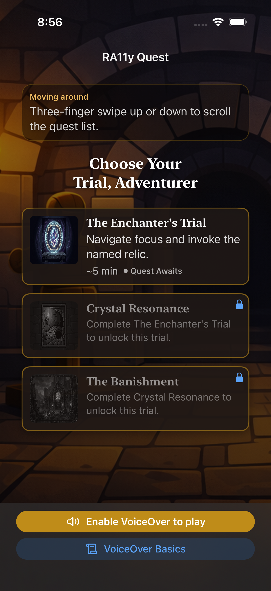
    </td>
    <td align="center">
      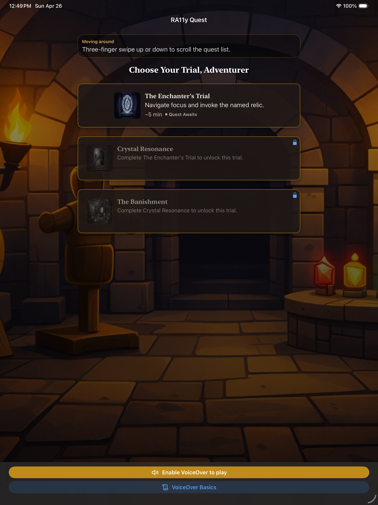
    </td>
  </tr>
  <tr>
    <td align="center"><sub>iPhone large</sub></td>
    <td align="center"><sub>iPad</sub></td>
  </tr>
</table>

Each card shows the quest thumbnail, name, goal, and best-rank badge once a run
has been completed. Cards are full accessibility elements: the label includes the
quest name and objective; the hint says "Double-tap to begin."

---

### First Spell: Magic Tap

**Skill taught:** VoiceOver Magic Tap — two-finger double-tap to trigger the
primary action without hunting for a button.

First Spell is the onboarding bridge before ranked hub quests. It checks whether
VoiceOver is enabled, presents a focused ready state, then confirms the player can
perform Magic Tap before moving into the basics sequence.
(`testScreenshots_FirstSpell` in `RA11y_iOSScreenshots.swift`.)

<table>
  <tr>
    <th>Entry</th>
    <th>VoiceOver gate</th>
    <th>Ready</th>
    <th>Success</th>
  </tr>
  <tr>
    <td align="center">
      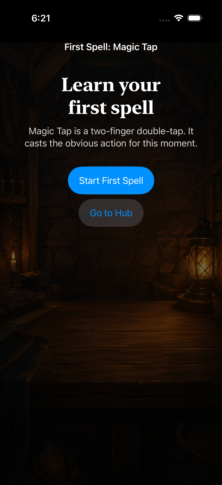
    </td>
    <td align="center">
      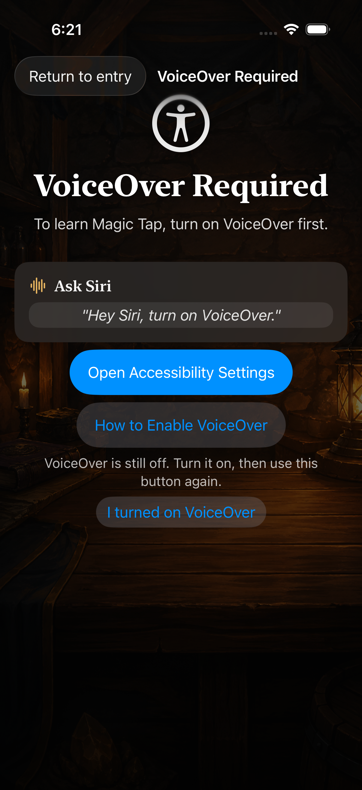
    </td>
    <td align="center">
      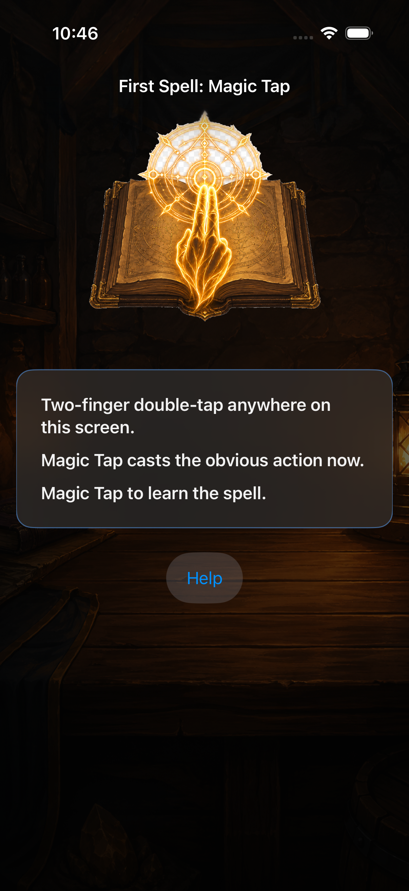
    </td>
    <td align="center">
      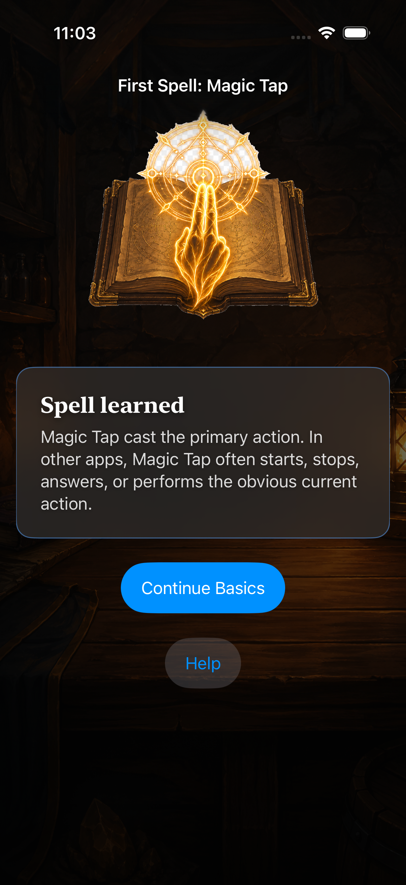
    </td>
  </tr>
  <tr>
    <td align="center"><sub>iPhone large</sub></td>
    <td align="center"><sub>iPhone large</sub></td>
    <td align="center"><sub>iPhone large</sub></td>
    <td align="center"><sub>iPhone large</sub></td>
  </tr>
</table>

---

### The Enchanter's Trial

**Skill taught:** VoiceOver focus navigation — swipe right to move focus element
by element; double-tap to activate the focused element.

**The lesson:** The screen is now linear. You navigate one element at a time.
Swipe to walk through the room. Double-tap when you find the named relic.

The quest follows a three-stage arc. Each stage removes a layer of scaffolding
until the player is navigating entirely on their own under a hard time limit.

#### L0 — The Prologue

The Dungeon Master introduces the quest and explains the VoiceOver focus model
before the player attempts anything. A lesson card names the gesture. The player
cannot proceed until they have read (or listened to) the objective.

<table>
  <tr>
    <td align="center">
      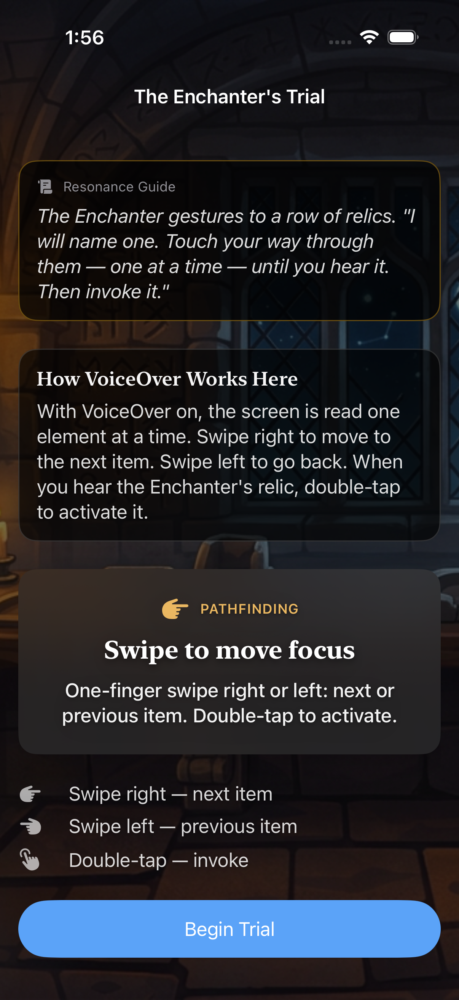
    </td>
    <td align="center">
      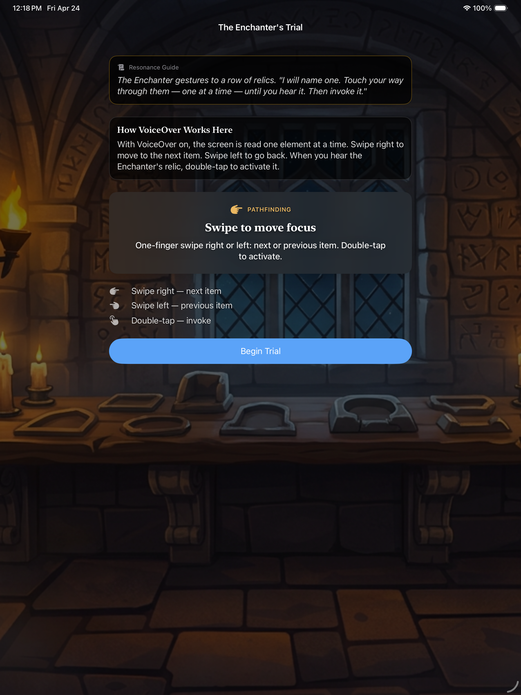
    </td>
  </tr>
  <tr>
    <td align="center"><sub>iPhone large</sub></td>
    <td align="center"><sub>iPad</sub></td>
  </tr>
</table>

#### L1 — First Attempt (untimed)

Three relics on the shelf. The Enchanter names the target. No timer, no pressure.
The player swipes through the relics, hears each name announced by VoiceOver, and
double-taps the correct one. A wrong activation is noted but does not end the
attempt. Goal: build confidence — "I can do this."

<table>
  <tr>
    <td align="center">
      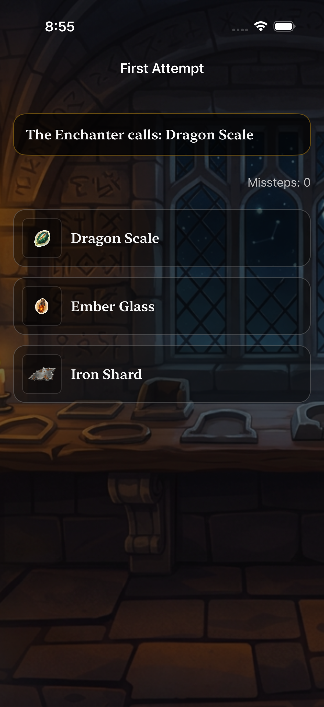
    </td>
    <td align="center">
      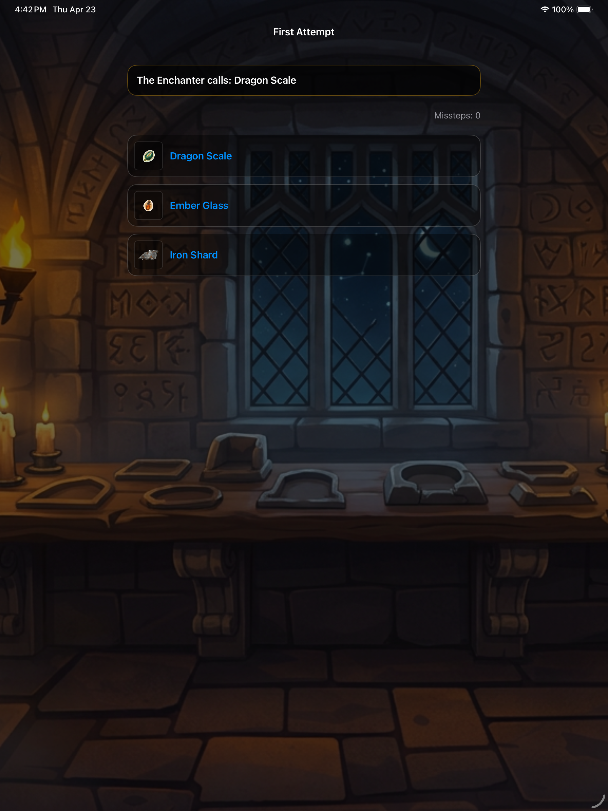
    </td>
  </tr>
  <tr>
    <td align="center"><sub>iPhone large</sub></td>
    <td align="center"><sub>iPad</sub></td>
  </tr>
</table>

#### L2 — Rising Challenge (soft timer)

Six relics with deliberately similar-sounding names (Dragon Scale vs Dragon Claw,
Shadow Stone vs Sunstone). A soft 45-second timer introduces gentle urgency.
VoiceOver announces the timer at 50% and 25% elapsed. Mistakes count. The player
must listen carefully — two items sound nearly identical.

<table>
  <tr>
    <td align="center">
      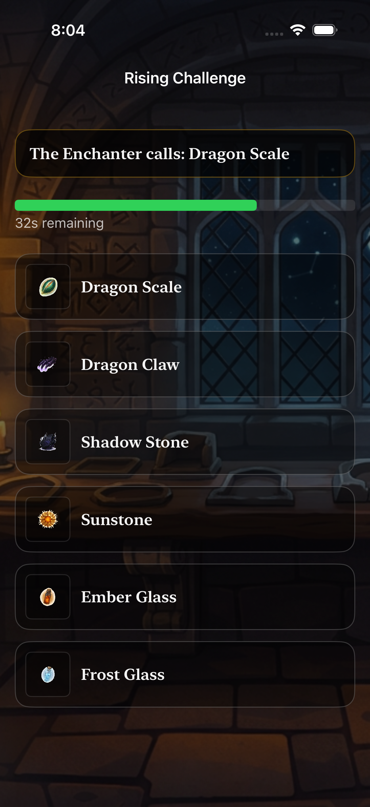
    </td>
    <td align="center">
      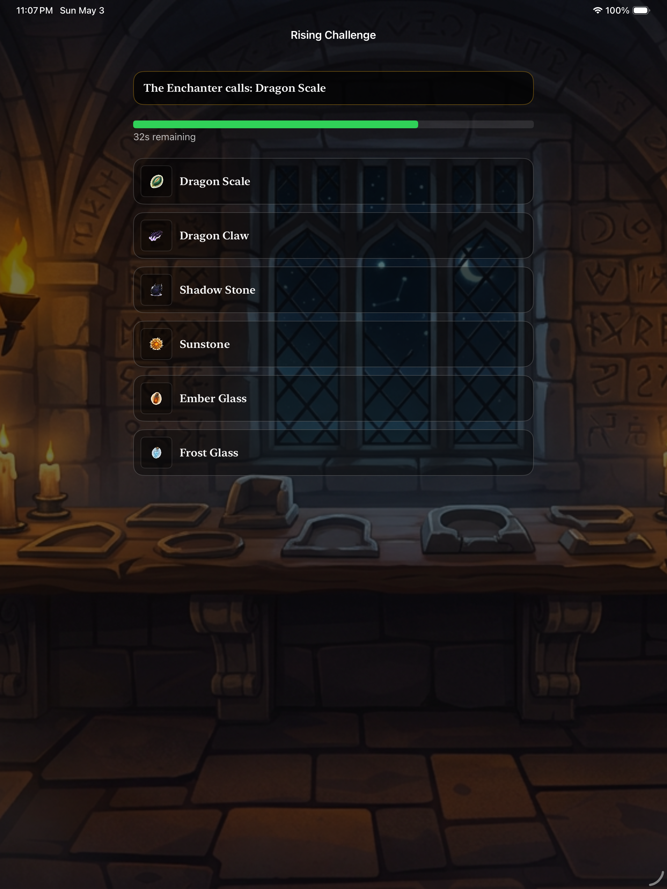
    </td>
  </tr>
  <tr>
    <td align="center"><sub>iPhone large</sub></td>
    <td align="center"><sub>iPad</sub></td>
  </tr>
</table>

#### L3 — Timed Trial (hard timer, scored)

Eight relics. Twenty seconds. No hints. VoiceOver counts down at 10 seconds then
5-4-3-2-1. The progress bar depletes in real time. A rank is awarded at the end:
Legendary, Skilled, Novice, or Defeated. This is the only scored stage.

<table>
  <tr>
    <td align="center">
      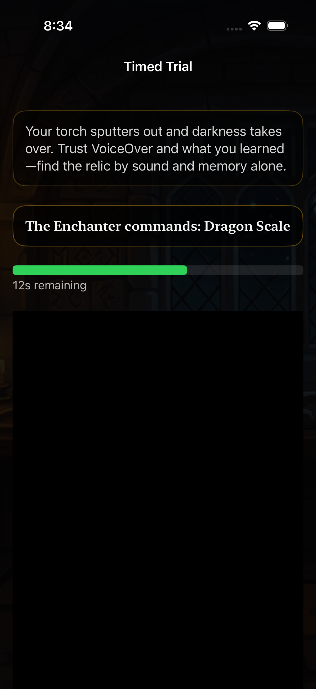
    </td>
    <td align="center">
      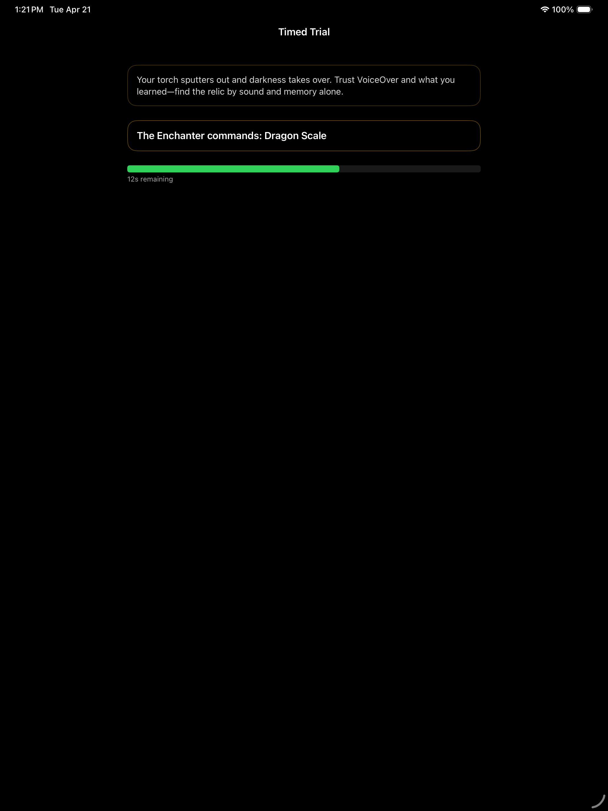
    </td>
  </tr>
  <tr>
    <td align="center"><sub>iPhone large</sub></td>
    <td align="center"><sub>iPad</sub></td>
  </tr>
</table>

#### Result Screen

Rank, time, and mistake count are displayed with D&D-flavoured copy. The result
is persisted as the player's best run for that quest. VoiceOver reads the full
result as a single announcement on screen load.

<table>
  <tr>
    <td align="center">
      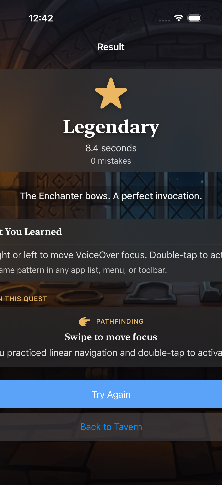
    </td>
    <td align="center">
      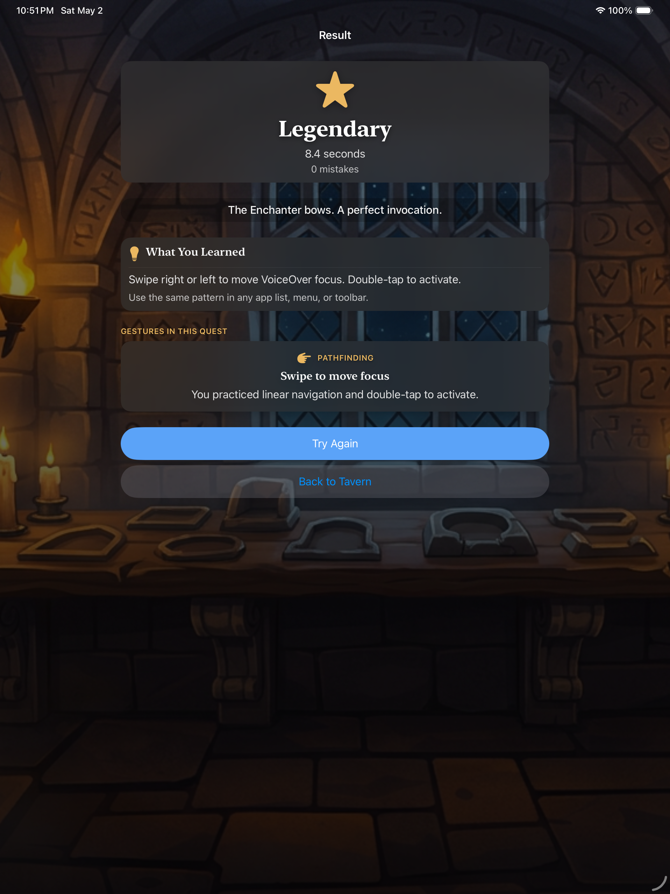
    </td>
  </tr>
  <tr>
    <td align="center"><sub>iPhone large</sub></td>
    <td align="center"><sub>iPad</sub></td>
  </tr>
</table>

---

### Crystal Resonance

**Skill taught:** Three-finger scroll — one finger moves VoiceOver focus; three
fingers move the scrollable world.

**The lesson:** Focus the resonance lane, then use three-finger scroll gestures
to move the glyph stream until the Moonstone aligns with the orb. The quest
teaches the difference between navigating controls and moving off-screen content.

Crystal Resonance still uses `Dungeon*` screenshot basenames and `dungeon*` scene
IDs for contract stability, but the player-facing UI and catalog copy are Crystal
Resonance. Deterministic captures cover the prologue, first playable alignment
attempt, and sample result.
(`testScreenshots_Dungeon` in `RA11y_iOSScreenshots.swift`.)

#### L0 — The Prologue

The Dungeon Master introduces the Moonstone alignment rule and the three-finger
scroll gesture. A practice zone confirms the player has moved the scroll surface
before beginning the trial.

<table>
  <tr>
    <td align="center">
      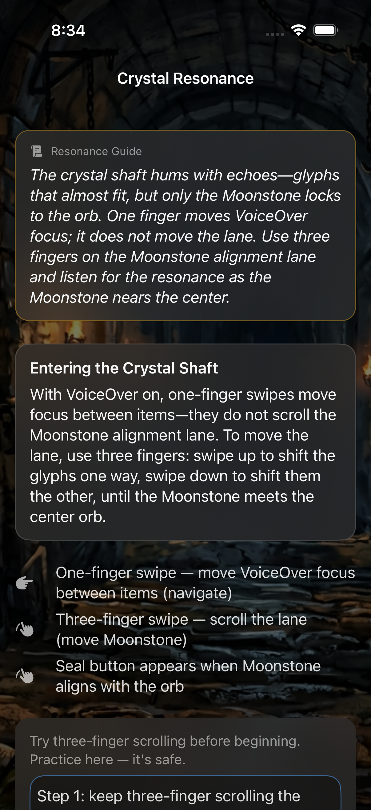
    </td>
    <td align="center">
      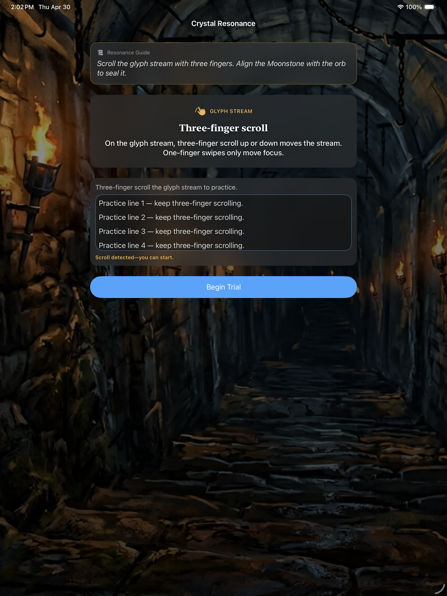
    </td>
  </tr>
  <tr>
    <td align="center"><sub>iPhone large</sub></td>
    <td align="center"><sub>iPad</sub></td>
  </tr>
</table>

#### L1 — First Attempt

The resonance lane starts with a small set of glyphs. The Moonstone is reachable
without a timer, and the HUD keeps the objective explicit: align the Moonstone
with the orb, then activate the seal.

<table>
  <tr>
    <td align="center">
      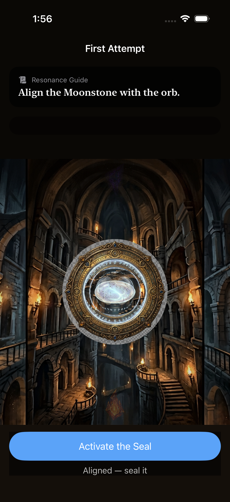
    </td>
    <td align="center">
      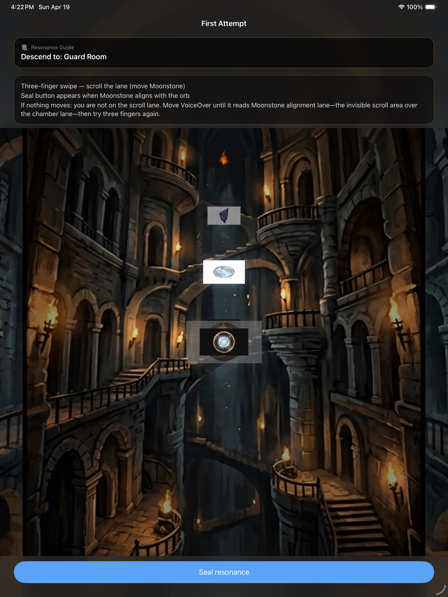
    </td>
  </tr>
  <tr>
    <td align="center"><sub>iPhone large</sub></td>
    <td align="center"><sub>iPad</sub></td>
  </tr>
</table>

#### Result Screen

The shared result screen records rank, time, and mistakes, then reinforces the
real-world transfer: three-finger scrolling reveals content that is off screen.

<table>
  <tr>
    <td align="center">
      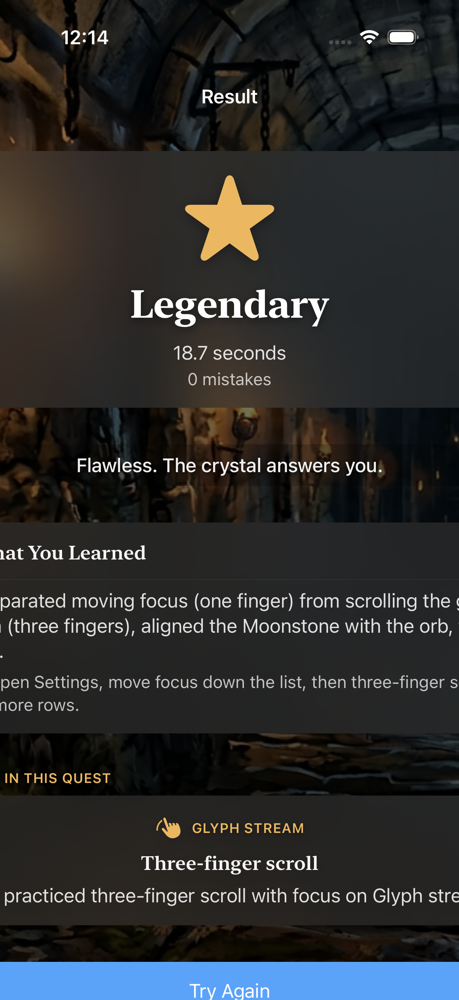
    </td>
    <td align="center">
      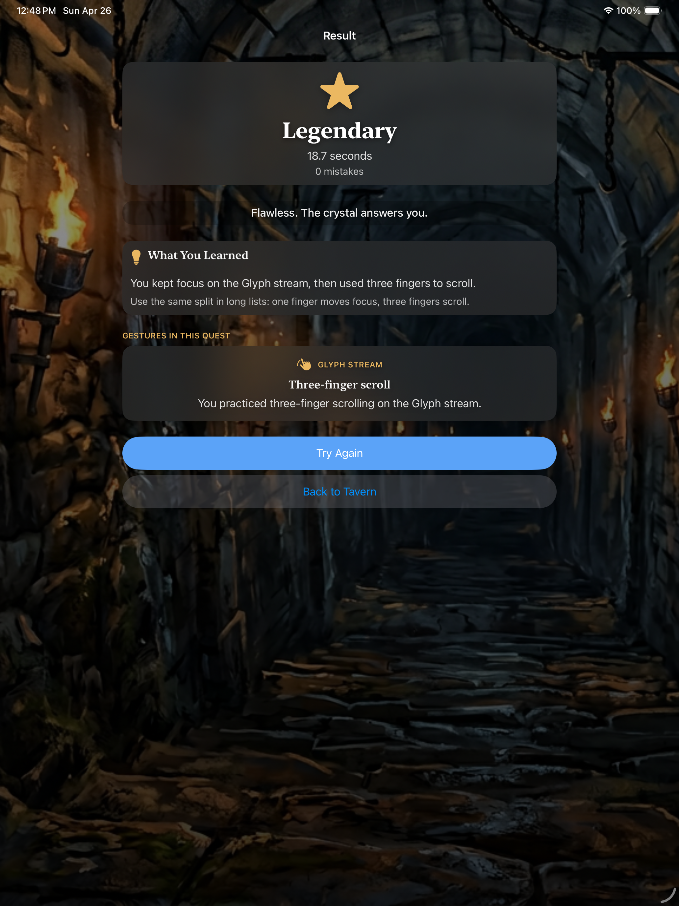
    </td>
  </tr>
  <tr>
    <td align="center"><sub>iPhone large</sub></td>
    <td align="center"><sub>iPad</sub></td>
  </tr>
</table>

---

### The Banishment

**Skill taught:** VoiceOver two-finger scrub (Z) / escape to dismiss modal traps.

The Banishment now uses the current QuestPaint UI direction: authored fantasy
art, readable painted text panels, a practice trap that responds to the escape
action, a timed tower beat, and a result screen that reinforces the real-world
escape gesture. Deterministic captures cover the prologue, practice ward with Z
hint, timed tower first beat, and sample result.
(`testScreenshots_Banishment` in `RA11y_iOSScreenshots.swift`.)

The README previews use the committed UI-test screenshot outputs from
`docs/screenshots/en-US/iPhone_large/`, so refreshing screenshots updates the
source images for this table without hand-maintained mockups.

<table>
  <tr>
    <th>Prologue</th>
    <th>Practice trap</th>
    <th>Timed tower</th>
    <th>Result</th>
  </tr>
  <tr>
    <td align="center">
      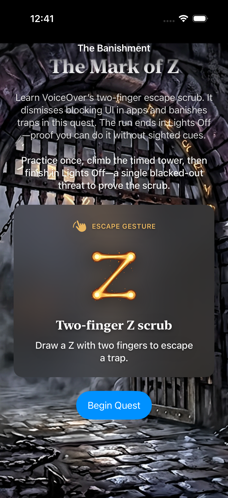
    </td>
    <td align="center">
      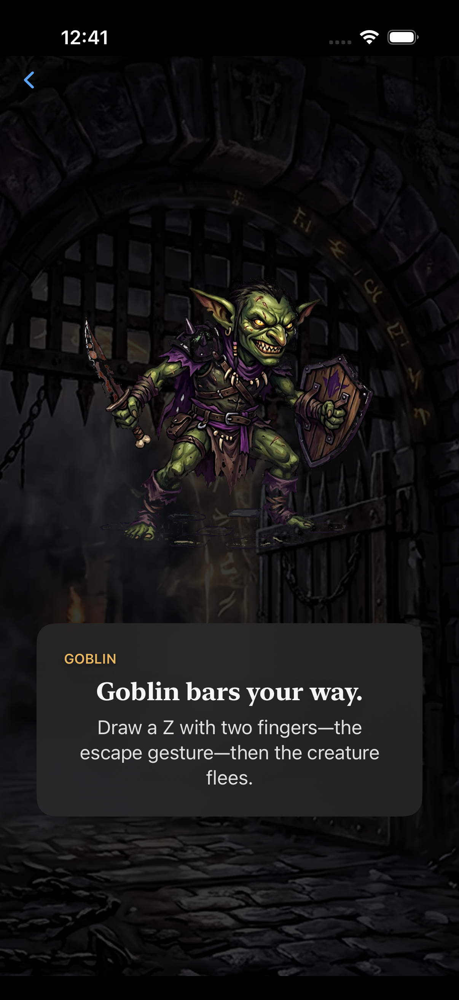
    </td>
    <td align="center">
      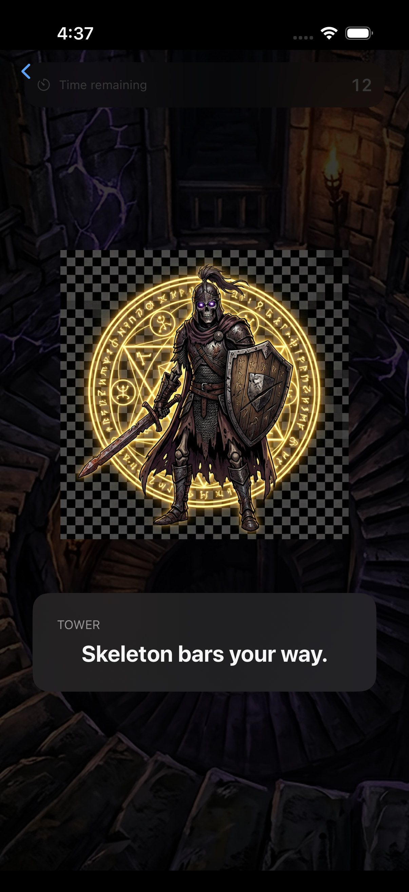
    </td>
    <td align="center">
      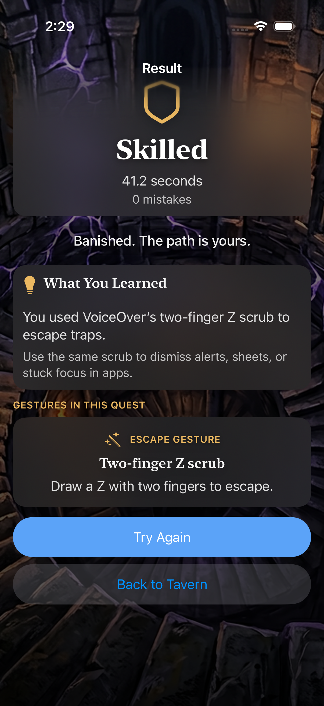
    </td>
  </tr>
  <tr>
    <td align="center"><sub>iPhone large</sub></td>
    <td align="center"><sub>iPhone large</sub></td>
    <td align="center"><sub>iPhone large</sub></td>
    <td align="center"><sub>iPhone large</sub></td>
  </tr>
</table>

Run `bundle exec fastlane ios screenshots` (without `SNAPSHOT_DEVICES`) to refresh **iPhone_large**, **iPhone_small**, and **iPad** folders as well.

**Banishment catalog gate:** `bash utility/validate_banishment_assets.sh`
validates required catalog entries before screenshots. Full matrix and
Definition of Done:
`memlog/requirements/Design/BanishmentAssetRequirements-Checklist.txt`.

**Screen audit gate:** `bash utility/validate_screen_audit.sh` validates the
captured screenshots through `ScreenAuditKit`, writes JSON/Markdown reports to
`build_results/screen-audit/`, and emits overlay artifacts for review-only
design findings. `bundle exec fastlane ios screenshots` runs ScreenAuditKit with
Vision OCR after capture (`RA11Y_SCREEN_AUDIT_OCR=vision` via
`utility/validate_screen_audit.sh`); use `bundle exec fastlane ios screen_audit`
for the same check against committed `docs/screenshots/en-US`. Banishment
screenshot warnings currently use
`RA11y-iOS/RA11y-iOSUITests/ScreenAuditAssetProvenance.json` to explain asset
source, authoring status, source quality, known risks, and evidence.

---

## Requirements

- Xcode 26+ (macOS Tahoe)
- iOS 26 deployment target
- Swift 6 (strict concurrency)
- iOS Simulator (auto-detected at runtime — no hardcoded device name required)

---

## Project Structure

```
RA11y-AccessibilityGamification/
├── RA11y.xcworkspace              Entry point — open this in Xcode
├── RA11y-iOS/                     iOS app target
│   ├── RA11y-iOS.xcodeproj
│   └── RA11y-iOS/
│       ├── App/                   AppRoute + iOSAppRouter (navigation)
│       ├── Hub/                   Hub view
│       ├── Results/               Shared game result screen
│       ├── VoiceOver/             Live VoiceOver state provider + help sheet
│       └── VoiceOverRequired/     Interstitial shown when VoiceOver is off
├── RA11yCore/                     Shared Swift package (iOS 18+, macOS 15+)
│   ├── Sources/RA11yCore/
│   │   ├── Design/                Font + spacing + radius tokens
│   │   ├── GameCatalog/           Game definitions and catalog lookup
│   │   ├── GameSession/           Session state machine + coordinator
│   │   ├── Hub/                   HubViewModel (VoiceOver-driven affordance)
│   │   ├── Logging/               OSLog subsystem (5 categories)
│   │   ├── Results/               GameResultPresenter (formatting + accessibility)
│   │   ├── Scoring/               GameRank, GameResult, RankThresholds
│   │   ├── Storage/               StorageComponent protocol + UserDefaults impl
│   │   └── VoiceOver/             VoiceOverStateProvider protocol + stub
│   └── Tests/RA11yCoreTests/
├── ScreenAuditKit/                Local SPM package for screenshot validation
│   ├── Sources/ScreenAuditKit/    Contracts, evidence, rules, reports
│   └── Sources/screenaudit/       CLI used by local/Fastlane audit commands
├── utility/
│   └── build_and_test.sh          Build and test script (see below)
├── build_results/                 Script output — gitignored
└── memlog/                        Project notes, requirements, and design docs
```

Future platform targets (`RA11y-macOS/`, `RA11y-tvOS/`) follow the same pattern:
one `.xcodeproj` per platform, each referenced by `RA11y.xcworkspace`.

---

## Building and Testing

### Open in Xcode

```
open RA11y.xcworkspace
```

### Build script

`utility/build_and_test.sh` builds and tests both `RA11yCore` (natively on macOS,
fast) and the `RA11y-iOS` app target (on the iOS Simulator). Results are written
to `build_results/<timestamp>/summary.md`.

**Default run (Core + iOS):**

```bash
utility/build_and_test.sh
```

**Common options:**

```bash
# Core only (no simulator needed — runs fast)
utility/build_and_test.sh --only-core

# iOS only
utility/build_and_test.sh --only-ios

# Prefer a specific simulator (auto-detected from simctl if omitted)
utility/build_and_test.sh --sim "iPhone large"

# Clean before build
utility/build_and_test.sh --clean

# Verbose output (streams xcodebuild to console)
utility/build_and_test.sh --verbose

# List available workspace schemes
utility/build_and_test.sh --list-schemes

# Full options
utility/build_and_test.sh --help
```

### Swift package tests only (fastest, no simulator)

`RA11yCore` targets both iOS 18 and macOS 15, so its tests run natively on macOS:

```bash
swift test --package-path RA11yCore
swift test --package-path ScreenAuditKit
```

### Screenshot and design audit

```bash
bash utility/validate_screen_audit.sh
bundle exec fastlane ios screen_audit
bundle exec fastlane ios screenshots   # capture, then Vision screen audit (see Fastfile)
```

The screen audit package is intentionally generic. RA11y provides the app-specific
contracts in `RA11y-iOS/RA11y-iOSUITests/ScreenAuditContracts.json` and asset
provenance in `RA11y-iOS/RA11y-iOSUITests/ScreenAuditAssetProvenance.json`.

---

## Architecture

**`RA11yCore`** is a platform-agnostic Swift package containing all business logic:
scoring, session lifecycle, storage, VoiceOver state abstraction, and game catalog.
It has no UIKit or SwiftUI imports. Tests run on macOS without a simulator.

**`RA11y-iOS`** is a SwiftUI-first app target that depends on `RA11yCore`.
It owns all platform-specific code: live VoiceOver detection, navigation, and views.
Files are OS-prefixed (`iOSRootView.swift`, `iOSHubView.swift`, etc.) to keep
intent clear as additional platform targets are added.

**Concurrency:** Swift 6 strict concurrency throughout. `@MainActor` is the default
actor for the iOS app target. Shared mutable state is isolated with `actor` types.
`async/await` for all asynchronous operations; no GCD or completion handlers.

**Dependency injection:** constructor injection. Protocols abstract platform
boundaries (e.g., `VoiceOverStateProvider`, `StorageComponent`) so all logic
is testable without UIKit or a simulator.

---

## Accessibility Standards

This project is itself an accessibility training tool, so it holds itself to a
higher bar than most apps:

- VoiceOver required to play the games (by design)
- No information conveyed by color alone
- All interactive elements have `accessibilityLabel` and `accessibilityHint`
- Dynamic Type supported at all sizes including the largest accessibility sizes
- Timer UI announces at defined thresholds only — never continuously
- Reading order is deterministic on every screen

---

## Status

| Milestone | Description | Status |
|---|---|---|
| M0 | Infrastructure, CI, Swift package setup | Done |
| M1 | Core models — scoring, session, storage | Done |
| M2 | VoiceOver gating, interstitial, help affordance | Done |
| M3 | Hub UI — quest board, D&D theming, all device sizes | Done |
| M4 | First-run basics sequence | Done |
| M5 | The Enchanter's Trial | Done |
| M6 | Crystal Resonance / Dungeon Descent refinement | In Progress |
| M7 | The Banishment | Review / Audit |
| M8 | ScreenAuditKit screenshot and design audit workflow | In Progress |

Current UI and design consistency tasks live in `memlog/designRefactorTasks.md`.
Screen audit package tasks live in `memlog/research/ScreenAuditKit-Workstream.md`.
