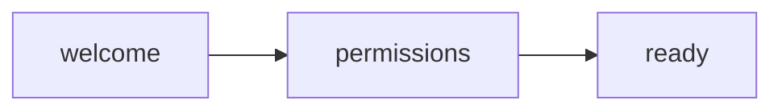

# Screen Audit Flow Summary

- Project: Flow Walkthrough
- Flows: 1

## Release Onboarding

- Flow ID: releaseOnboarding
- Steps: 3

| Step | Screen | Required | Status | Note |
|---:|---|---|---|---|
| 1 | welcome | yes | present |  |
| 2 | permissions | yes | present |  |
| 3 | ready | yes | present |  |

### Flow graph (advisory)

