# ScreenAuditKit Feature Walkthrough

ScreenAuditKit turns screenshot review into structured, repeatable evidence. It catches copy, layout, visual artifact, asset, device-profile, and flow regressions before release, then leaves behind PNGs, JSON, overlays, and summaries that QA, Design, Product, and Engineering can inspect together.

This walkthrough is backed by `ScreenAuditFeatureWalkthroughTests`. The images below are deterministic Swift/AppKit/CoreGraphics fixtures generated by the test suite, then curated into `Artifacts/` with `refresh_artifacts.sh`. They are intentionally mechanical, but they look like plausible iOS, iPadOS, tvOS, and macOS UI states so the product risk is visible before reading the logs.

## How To Refresh

From the repository root:

```bash
swift test --package-path ScreenAuditKit
bash ScreenAuditKit/Docs/FeatureWalkthrough/refresh_artifacts.sh
```

The refresh script copies curated files from `ScreenAuditKit/.build/test-artifacts/feature-walkthrough/` into this package-local `Artifacts/` directory. The committed document never depends on `.build` paths.

## Missing Critical Action In An iOS Alert

Product risk: destructive UI without a recovery action can ship because a reviewer sees the `Delete` path but misses the absent `Cancel` affordance.

| Pass | Fail |
|---|---|
| 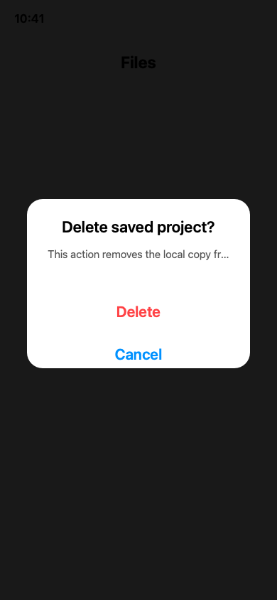 | 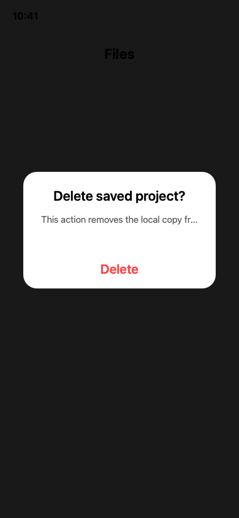 |

Expected finding: `requiredTextMissing` for `Cancel`.

Proof excerpt from `Artifacts/ios-alert/summary.md`: `Required text 'Cancel' was not found.`

Test method: `testIOSAlertWalkthroughCatchesMissingCancelAction`

Business value: makes required recovery actions contractual instead of relying on manual visual memory.

## Forbidden Debug Text In Production Settings

Product risk: internal build labels, TODO notes, and developer placeholders can leak into App Store or customer-facing screenshots.

| Pass | Fail |
|---|---|
| 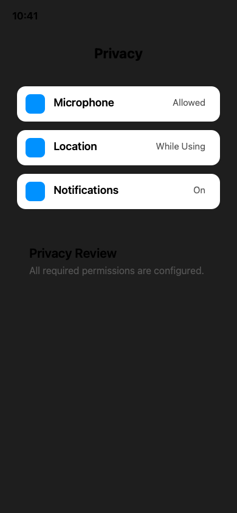 | 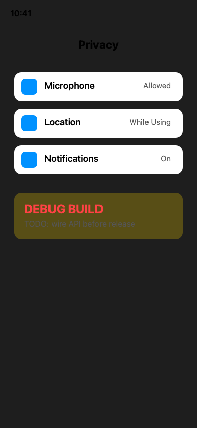 |

Expected finding: `forbiddenTextPresent` for `DEBUG BUILD` and `TODO`.

Proof excerpt from `Artifacts/settings-debug/summary.md`: `Forbidden text 'DEBUG BUILD' was found.`

Test method: `testSettingsWalkthroughCatchesForbiddenDebugCopy`

Business value: turns release-copy hygiene into a deterministic CI gate.

## No-OCR Fast Path Is Truthful

Product risk: a fast local audit should not pretend it checked text when OCR was intentionally disabled.

Fixture:


Expected finding: `textRulesSkipped` at `info` severity, with no hard failure.

Proof excerpt from `Artifacts/no-ocr/summary.md`: `Skipped 1 required and 1 forbidden text rule(s) because OCR was not requested.`

Test method: `testNoOCRWalkthroughReportsSkippedTextRules`

Business value: engineers get fast metadata and visual checks locally while CI/Fastlane can still enforce OCR text contracts with `--ocr vision`.

## Clipped Onboarding Copy And Protected UI Drift

Product risk: fixed-height cards can clip instructions or CTAs in ways OCR may still partially read, especially under larger text or compact layouts.

| Baseline | Ignored volatile change | Fail: clipped copy/CTA |
|---|---|---|
| 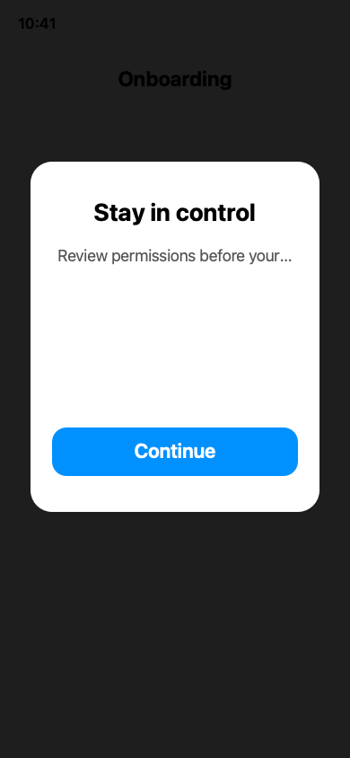 | 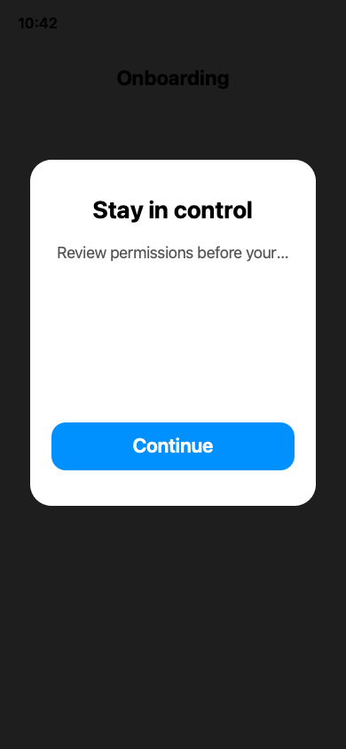 | 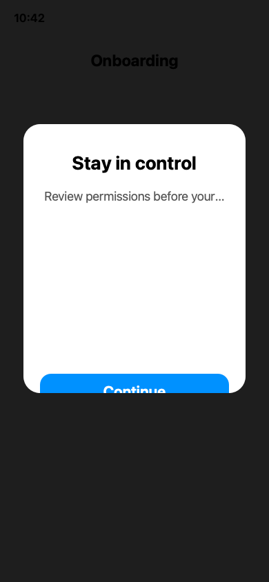 |

Expected finding: `baselineDifferenceExceeded` outside ignored clock/badge regions.

Proof excerpt from `Artifacts/baseline-drift/summary.md`: `Baseline mismatch ratio 0.0659 exceeded allowed ratio 0.0100.`

Test method: `testBaselineWalkthroughIgnoresClockButFlagsClippedCTA`

Business value: screenshot baselines can ignore expected volatility while still catching meaningful layout regressions.

## Wrong Device Or Orientation Capture

Product risk: a landscape or wrong-device screenshot can silently drop bottom navigation and invalidate release review artifacts.

| Pass | Fail |
|---|---|
| 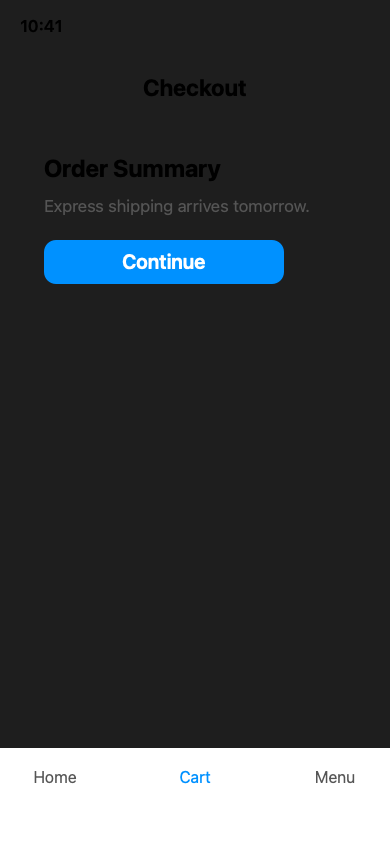 | 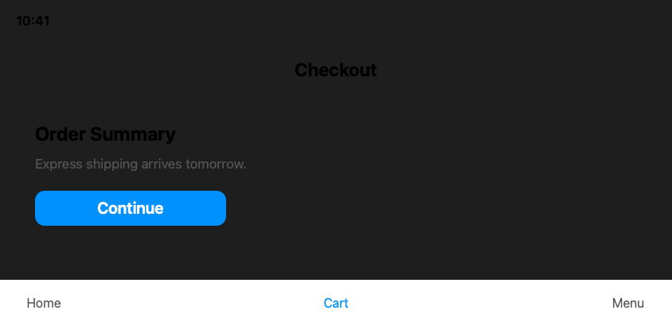 |

Expected finding: `dimensionMismatch`.

Proof excerpt from `Artifacts/device-orientation/summary.md`: `Screenshot dimensions were 844x390; expected one of: 'fixture' 390x844.`

Test method: `testWrongOrientationWalkthroughCatchesDeviceProfileMismatch`

Business value: stops the audit before comparing screenshots captured from the wrong simulator family or orientation.

## tvOS Focus Ring Lost

Product risk: a tvOS screen can look complete but become unusable when the focused tile loses its ring or focus styling.

| Pass | Fail |
|---|---|
| 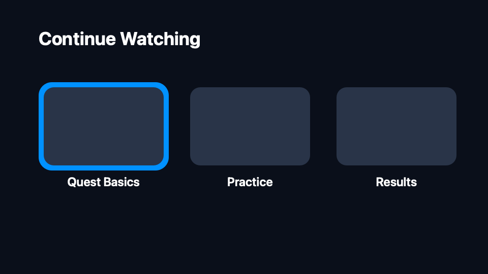 | 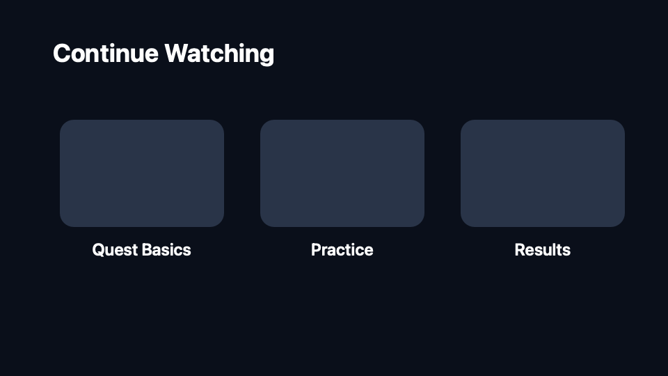 |

Expected finding: `baselineDifferenceExceeded`.

Proof excerpt from `Artifacts/tvos-focus/summary.md`: `Baseline mismatch ratio 0.0157 exceeded allowed ratio 0.0100.`

Test method: `testTVFocusWalkthroughCatchesLostFocusRing`

Business value: protects remote-navigation affordances that are easy to miss in static screenshot review.

## macOS Toolbar Item Missing

Product risk: resizing or toolbar changes can remove desktop chrome actions even while the main content still looks correct.

| Pass | Fail |
|---|---|
| 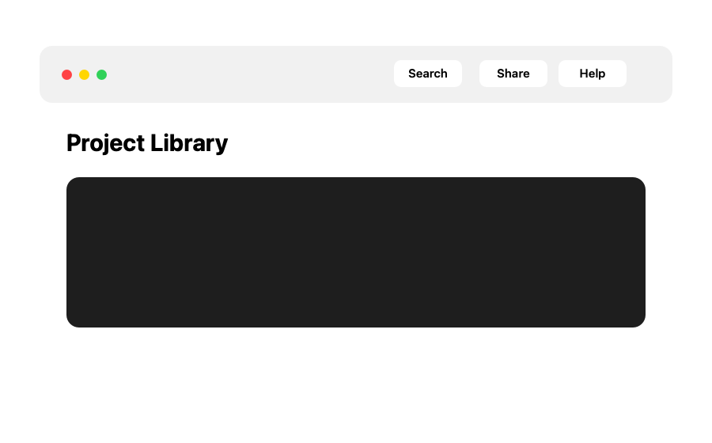 | 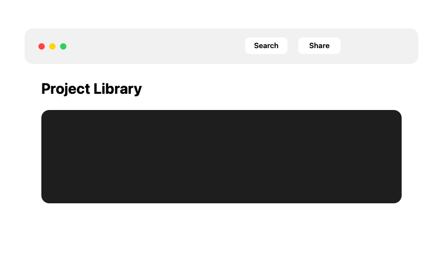 |

Expected finding: `requiredTextMissing` for `Help`.

Proof excerpt from `Artifacts/mac-toolbar/summary.md`: `Required text 'Help' was not found.`

Test method: `testMacToolbarWalkthroughCatchesMissingHelpItem`

Business value: makes important desktop actions part of the release contract.

## Broken Artwork And Asset Export Defects

Product risk: missing assets, transparency-bed artifacts, and bad alpha cleanup can make an otherwise functional UI look unfinished or broken.

| Pass | Fail: flat placeholder | Fail: checkerboard bed | Fail: opaque alpha border |
|---|---|---|---|
| 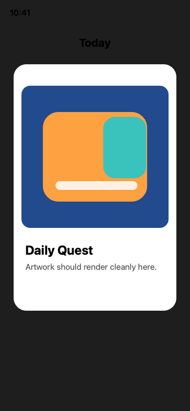 | 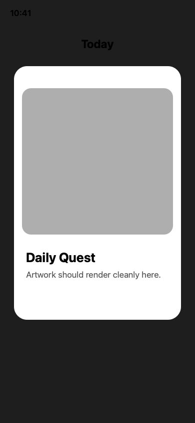 |  |  |

Expected findings: `renderedMatteRisk`, `checkerboardPatternRisk`, and `suspiciousOpaqueBorder`.

Proof excerpt from `Artifacts/visual-artifacts/summary.md`: `Findings: 3`

Test method: `testVisualArtifactWalkthroughProducesFindingsAndOverlays`

Business value: catches visual defects that pure accessibility, copy, and unit tests do not see.

## Incomplete Product Journey

Product risk: screenshot capture can include a later success or ready state while skipping an earlier required permissions or setup screen.

| Pass: complete journey | Fail: missing Permissions step |
|---|---|
| 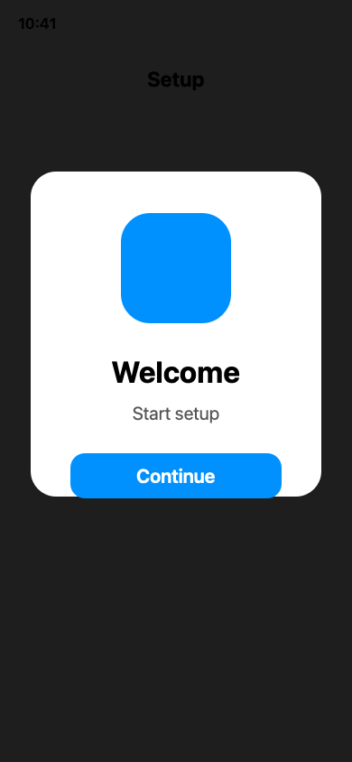   |   |

Expected finding: flow summary marks `permissions` as missing while `ready` is present.

Proof excerpt from `Artifacts/flow-completeness/flow-summary.md`: `| 2 | permissions | yes | missing |`

Test method: `testFlowWalkthroughCatchesMissingPermissionsStep`

Business value: validates the release narrative, not just isolated PNG files.

## Clean Happy Path

Product risk: a noisy audit loses trust if healthy evidence is flagged.


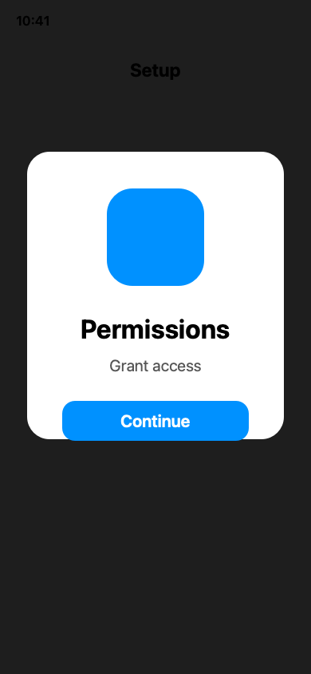
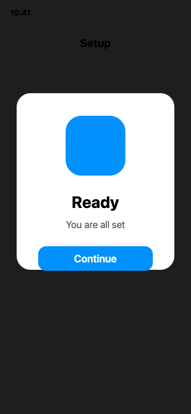

Expected result: zero findings.

Proof excerpt from `Artifacts/clean-happy-path/summary.md`: `No findings.`

Test method: `testCleanHappyPathWalkthroughProducesNoFindings`

Business value: proves the kit can distinguish healthy evidence from defective evidence.

## What This Changes Operationally

ScreenAuditKit gives app teams a portable screenshot evidence package instead of a folder of images and subjective review notes. Product can see the user-facing risk, QA can inspect overlays and summaries, Design can decide whether a visual diff is intentional, and Engineering can enforce the same contract in CI.

The practical impact is fewer manual screenshot review misses, clearer release gates, cleaner QA/design handoff, and proof artifacts that can travel with ScreenAuditKit when it becomes its own repository.
