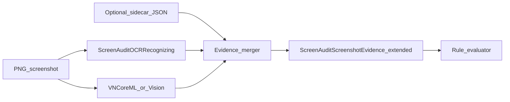

# ScreenAuditKit: Native Apple UI Element Detection (Research)

**Status:** Research / pre-spike  
**As of:** 2026-05-03  
**Audience:** RA11y maintainers planning ScreenAuditKit evolution  
**Related:** [ScreenshotAndScreenAudit-GoldenPath.md](ScreenshotAndScreenAudit-GoldenPath.md), [ADR-0002-AI-Assisted-Screenshot-Validation.md](ADR-0002-AI-Assisted-Screenshot-Validation.md), [ScreenAuditKit README](https://github.com/SerialForBreakfast/ScreenAuditKit)

---

## 1. Purpose

This document explores whether and how RA11y can add **robust detection of native Apple platform UI** (system and standard controls) to **ScreenAuditKit**, in a way that is:

- **Actionable** for screenshot-first audits (CI, committed PNGs, Fastlane output).
- **Accurate** where it matters (bounds, roles, truncation, chrome vs content).
- **Maintainable** across OS visual refreshes, Dynamic Type, and multiple Apple platforms (iOS, iPadOS, tvOS, macOS).

It does **not** commit to shipping a Core ML model or new public APIs in ScreenAuditKit. It defines **feasibility**, **dataset and labeling practices**, **open research**, and a **proposed integration shape** parallel to existing OCR injection.

---

## 2. Why not a real `VNRecognizeUIElementRequest`?

Apple’s Vision framework exposes **pixel-level** operations (text, rectangles, generic classification, custom `VNCoreMLRequest`, etc.). It does **not** document a request that returns **UIKit/AppKit/SwiftUI class names** or a stable **semantic role graph** for arbitrary screenshots.

**Reasons Apple is unlikely to ship a public equivalent:**

- **Rendering is private and variable** across OS versions, themes, Liquid Glass–era materials, accessibility settings, and device form factors.
- **The same semantic control** can be implemented with different view hierarchies (UIKit vs SwiftUI, custom containers).
- **Security and fingerprinting** concerns if APIs inferred app structure from pixels at scale without user intent.

**Implication for RA11y:** Treat “`VNRecognizeUIElementRequest`” as a **product concept**: a **composed pipeline** (Vision + optional Core ML + optional **paired hierarchy metadata**), not a single framework call.

---

## 3. Feasibility overview

| Mode | Inputs | Expected capability | Fit for ScreenAuditKit “drop-in” |
|------|--------|---------------------|----------------------------------|
| **A. PNG-only** | Screenshot bytes | Coarse **regions** and **visual roles** (e.g. “toolbar-like”, “alert-like”, “tab-like”); **no** guaranteed mapping to private UIKit types | Moderate: useful heuristics + rules; **high drift** on OS updates |
| **B. PNG + sidecar** | PNG + JSON from same test run (scale, OS, traits, hierarchy boxes) | **High accuracy** bounds and roles for **defined taxonomy**; model can be **smaller** or **optional** (rules over hierarchy) | Strong: aligns with deterministic audit philosophy |
| **C. Hierarchy-only** | No ML; XCTest / accessibility export | **Highest** structural truth when running UI tests | Best for **in-process** validation; not applicable to **orphan PNGs** in docs |

**Verdict:** A **drop-in** that works on **arbitrary committed PNGs** without sidecars is **possible but bounded**—plan for **recalibration** when Apple changes system chrome. A **robust** system for RA11y should **standardize sidecar provenance** (see [ADR-0005](ADR-0005-Native-Screenshot-Flow-And-Pedagogy-Validation.md) direction) and treat **pixel models** as **fallback** or **cross-check**, not the sole source of truth.

---

## 4. Proposed architecture (hybrid)

Two paths feed a unified **evidence** model consumed by rules:

1. **Hierarchy path (ground truth generator)**  
   In a **fixture app** or **UI test**, enumerate elements (XCTest and/or accessibility APIs), emit **normalized rectangles** and **semantic labels** into a **versioned sidecar** schema bundled next to the PNG (or referenced in ScreenAudit asset provenance).

2. **Pixel path (Vision + Core ML)**  
   On the **macOS validation host** (same constraint as today’s `VNRecognizeTextRequest` usage), run:
   - Existing OCR ([`ScreenAuditOCRRecognizing`](../../ScreenAuditKit/README.md)) for **text** and truncation heuristics.
   - Optional **`VNCoreMLRequest`** with a **detector** or **classifier** trained on **synthetic** Apple UI for **chrome**, **alerts**, **navigation**, **island/notch** cues, etc.

**Composition rules (research recommendation):**

- When **sidecar present and checksum-matched** to PNG: **prefer** hierarchy for **element boxes and roles**; use pixel model for **consistency checks** (e.g. “OCR says `Delete` but hierarchy has no `destructive` button”).
- When **PNG only**: run pixel model + OCR; surface **confidence** and **wider** tolerances in contracts.

### 4.1 Data flow (conceptual)



---

## 5. Taxonomy design (what to predict)

**Do not** target private class strings (`UIAlertController`) as the primary label set. Prefer **stable semantic roles** useful for accessibility and screenshot contracts, for example:

- **Chrome:** `statusBar`, `navigationBar`, `tabBar`, `toolbar`, `sidebar`, `windowTitlebar` (macOS), `dock` (macOS, if in scope).
- **Containers:** `alert`, `actionSheet`, `sheet`, `popover`, `menu`, `contextMenu`.
- **Controls:** `primaryButton`, `secondaryButton`, `destructiveButton`, `cancelAction`, `textField`, `secureField`, `switch`, `slider`, `segmentedControl`, `picker`, `listRow`, `searchField`.
- **Focus / TV:** `focusedElement`, `parallaxCard` (if visually detectable).
- **Special regions:** `dynamicIsland`, `notch`, `homeIndicator`, `keyboard` (if visible).

**Scope decision (open):**

- **Narrow (recommended first):** RA11y screenshot scenes + system dialogs used in quests/first-run.
- **Medium:** Common iOS system chrome across a **matrix** of devices in Simulator.
- **Wide:** Arbitrary App Store apps — **large domain shift**; defer unless there is a dedicated ML program.

---

## 6. Source of truth and labeling alignment (research topics)

Accurate training **requires** resolving **coordinate spaces** and **which frame** is authoritative.

### 6.1 Questions to resolve before dataset automation

1. **Points vs pixels:** How is `displayScale` captured and stored so **every** box in the sidecar maps 1:1 to PNG pixels (including @2x/@3x, Simulator vs device)?
2. **XCUIElement.frame** vs **accessibility frame** vs **visible rect** after transforms, clipping, and `clipsToBounds`.
3. **SwiftUI** hosting: does accessibility report match **visual** screenshot for composited layers (materials, blur, `safeAreaInset`)?
4. **Scroll views:** Ground truth for **partially visible** cells; label **occlusion** explicitly in the schema.
5. **Keyboard and sheets:** Transient UI — dataset episodes must include **timing** guarantees (capture after layout stable).
6. **Multi-window macOS:** Which window is captured and how window frames relate to **image crop**.

### 6.2 Sidecar schema (illustrative fields)

Document-only sketch; versioning is mandatory (`schemaVersion`).

- `schemaVersion`, `imageSHA256`, `pixelWidth`, `pixelHeight`
- `platform` (iOS, tvOS, macOS), `osVersion`, `build`, `deviceFamily` or `simulatorDeviceType`
- `displayScale`, `locale`, `layoutDirection`, `userInterfaceStyle`
- `contentSizeCategory`, `boldText`, `buttonShapes`, `differentiateWithoutColor`, `reduceTransparency`, `increaseContrast` (booleans or enums as available)
- `elements[]`: `{ role, a11yLabel?, normalizedRect | pixelRect, confidenceSource: hierarchy|synthetic }`

**Best practice:** For training exports, store **pixel-axis-aligned** boxes **and** normalized `[0,1]` rects for resolution-independent experiments.

---

## 7. Synthetic dataset generation (Swift-first harness)

### 7.1 Harness architecture

- **Dedicated fixture target** (or gated routes in the existing app) that renders **canonical scenes** under UI test control.
- **UI tests** iterate an **augmentation grid** (below), capture PNG via existing screenshot infrastructure, and emit **sidecar JSON** from the same run.
- **Single commit** pairs PNG + JSON to avoid drift.

### 7.2 Augmentation dimensions (document as a matrix)

| Dimension | Examples |
|-----------|------------|
| Dynamic Type | `.extraSmall` … `.accessibilityExtraExtraExtraLarge` |
| Bold Text | On / Off |
| Button Shapes | On / Off (where applicable) |
| Color scheme | Light / Dark |
| Layout | LTR / RTL |
| Contrast / transparency | Increase Contrast, Reduce Transparency |
| Truncation | Fixed-width labels with **controlled** long strings; single-line vs multi-line |
| Clipping | Scroll to **mid** content; **safe area** edge cases |
| Navigation | Inline title vs large title; back button presence |
| Alerts | 1–3 buttons; destructive placement; text field in alert |
| Device / idiom | Phone, pad, compact/regular, tv, mac window sizes |

### 7.3 Hard negatives

- Custom-styled controls that **mimic** system appearance.
- `WKWebView` with native-like controls (label as `webContent` in taxonomy).
- SF Symbol–only buttons (pair **hierarchy** labels with **pixel** ambiguity).

---

## 8. Model and training stack (decisions to research)

### 8.1 Task formulation

- **Object detection:** One-stage or two-stage detector; outputs boxes + class ids; good for **chrome** and **alert cards**.
- **Segmentation / layout:** Higher cost; consider only if rules need **pixel-precise** masks.
- **Separate OCR:** Keep **text** on [`ScreenAuditOCRRecognizing`](../../ScreenAuditKit/Sources/ScreenAuditKit/Evidence/ScreenAuditVisionOCRRecognizer.swift); fuse at **rule** layer unless experiments show clear benefit from multimodal fusion.

### 8.2 Tooling

| Approach | Pros | Cons |
|----------|------|------|
| **Create ML** (object detection / image classification) | Apple-native export, ANE-friendly | Less flexible for custom heads and large synthetic corpora |
| **PyTorch train → coremltools** | Flexible architectures, community detectors | Extra conversion pipeline; CI for conversion must be defined |
| **Heuristics + Vision rectangles** | No model shipping | Limited recall on new themes |

**Research tasks:** Benchmark **latency** on lowest-tier Mac used in CI; pick **input resolution** (resize vs tile); define **INT8** quantization impact on **small** UI elements (tab bar icons).

### 8.3 OS / device prediction from pixels

- **Bonus** classifiers (Dynamic Island vs notch vs neither; phone vs pad aspect) can help **branch rules** or **select** calibration tables.
- **Recommendation:** When sidecar exists, treat **OS/device as metadata**, not model outputs, for **reproducible** audits. Use pixel-based OS/device inference only for **orphan PNG** mode.

---

## 9. Robustness and evaluation

### 9.1 Metrics

- **Detection:** mAP at IoU 0.5 / 0.75 per class; per-class recall matters more than aggregate mAP for rare classes (e.g. destructive button).
- **Role confusion:** Matrix between `alert` vs `sheet` vs `popover`.
- **Truncation:** Task-specific — compare **OCR line count** and **hierarchy** `numberOfLines` / clipping flags where available; define **golden** “should truncate” screens.

### 9.2 Golden sets

- **Frozen splits** by `osVersion` × `deviceFamily` × `colorScheme` × `contentSizeCategory` (sparse grid, not full factorial if too large).
- **Regression policy:** Any contract change or OS baseline bump triggers **subset** re-capture (align with ScreenAuditKit feature walkthrough philosophy).

### 9.3 Drift

Treat **major iOS visual refresh** as requiring **new training slices** and **versioned** models (`modelVersion` in reports). Do not assume a single Core ML bundle lasts multiple major OS versions without revalidation.

---

## 10. Legal, privacy, and repository policy

- **Prefer synthetic data** from RA11y-controlled harnesses for training and redistribution inside the repo or approved artifact stores.
- **Third-party app screenshots** introduce licensing and **distribution shift**; treat as out-of-scope unless legal review exists.
- **AGENTS.md scripting policy:** Training **orchestration** that maintainers run should be documented as **bash** in `utility/` where possible; **heavy** notebook or Python **training** pipelines may live **outside** the repo or in a clearly named optional submodule—document the **contract** (inputs/outputs paths under project root for exported Core ML + manifest) so agents do not improvise forbidden one-offs in CI without review.

---

## 11. Prior art (high-level pointers)

- **RICO** and derivatives: large mobile UI corpora; often **Android-skewed**—useful for **architecture** inspiration and **negative examples**, not as a drop-in Apple chrome dataset.
- **GUI grounding / widget detection** literature: informs detector choice and **evaluation**; verify **transfer** to iOS system chrome with a **small** pilot before scaling labeling.

---

## 12. ScreenAuditKit integration sketch (future work)

Today, OCR is injectable via `ScreenAuditOCRRecognizing` and wired in `ScreenAuditValidator.makeDefault(ocr:)` ([`ScreenAuditValidation.swift`](../../ScreenAuditKit/Sources/ScreenAuditKit/Validation/ScreenAuditValidation.swift)).

**Proposed parallel abstraction (names TBD):**

```swift
/// Resolves native UI observations from screenshot bytes and optional sidecar metadata.
/// Must be callable from the same validation contexts as OCR (typically macOS host for PNG decode).
public protocol ScreenAuditNativeUIRecognizing {
    func recognizeNativeUI(
        inPNGData data: Data,
        path: String,
        sidecar: ScreenAuditNativeUISidecar?
    ) throws -> ScreenAuditNativeUIObservations
}
```

**Evidence:** extend [`ScreenAuditScreenshotEvidence`](../../ScreenAuditKit/Sources/ScreenAuditKit/Evidence/ScreenAuditEvidence.swift) **or** attach a **parallel** `native-ui.json` in the report output folder so **older** decoders and tests remain compatible.

**CLI:** mirror `--ocr none|vision` with something like `--native-ui none|coreml` once a model exists; default `none` preserves current behavior.

---

## 13. Non-goals (explicit)

- Recovering **exact SwiftUI** view types or **private** UIKit class names from pixels alone.
- **100%** coverage of arbitrary third-party App Store UIs without a dedicated dataset program.
- Replacing **Accessibility** audits or **XCTest** assertions; pixel ML **augments** screenshot contracts where hierarchy is unavailable.
- Running **training** inside every developer’s **ScreenAuditKit** unit test run (models belong behind optional flags / CI stages).

---

## 14. Prioritized research checklist

Use this as a **gating** list before implementation spikes.

### P0 — Blocking for any honest “drop-in” claim

1. **Coordinate spike:** One fixture scene, one PNG, hierarchy-exported boxes → prove **pixel alignment** within **≤1–2 px** at common scales.
2. **Taxonomy v0:** Frozen list of **≤20** roles for first vertical slice (e.g. alert + nav + primary/destructive buttons).
3. **Sidecar schema v1:** Versioned JSON with checksum linkage to PNG.

### P1 — Before Core ML investment

4. **Augmentation grid size:** Choose sparse **orthogonal** subset vs full factorial; estimate **capture time** in CI.
5. **Simulator vs device:** Measure **distribution shift** for a **single** scene (same Swift, different rendering).
6. **OCR fusion policy:** Document when OCR **overrides** or **contradicts** detector boxes for **text.required** rules.

### P2 — Model program

7. **Create ML vs PyTorch** decision with a **10k–50k** image feasibility sketch (storage, generation rate).
8. **Model versioning** and **rollback** in reports (`modelId`, `calibrationOsRange`).
9. **Quantization** study on **small** targets (toolbar glyphs, tab items).

### P3 — Platform expansion

10. **tvOS focus** and **macOS window** specific classes and capture hooks.
11. **Liquid Glass** (or subsequent) OS branches: **visual drift** monitoring strategy.

---

## 15. Suggested next step (spike, post-approval)

**Single-scene end-to-end:** fixture alert with two buttons → PNG + sidecar from UI test → manual overlay check → only then prototype **`VNCoreMLRequest`** on **cropped** regions vs **full-frame** detector.

---

## 16. Document history

| Date | Change |
|------|--------|
| 2026-05-03 | Initial research draft from ScreenAuditKit native UI detection plan |
